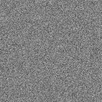
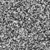
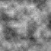
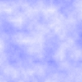
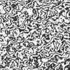
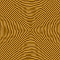
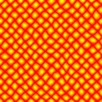
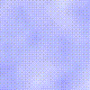

###This is a small C-SDL series about procedural textures.

**The Code demonstrates how to...**  

  * render noise (1).  
  * save a screenshot (1b).  
  * smooth noise (1c).  
  * add turbulence (1d).  
  * change turbulence with mousewheel (0-255) (1e).  
  * render Clouds - HSLtoRGB, change turbulence with mousewheel (0-255) (1f).  
  * generate a Marble Texture (1g). 
  * generate a Wood Texture (1h).  
  * add some more mathematical 2D functions (2).  
&nbsp;&nbsp;&nbsp;&nbsp;&nbsp;&nbsp; &nbsp;&nbsp;Use mousewheel to change drawing function.  
  * render 3D Random Noise animated with a function of time (3).  
 

Press s to save the image.  

**Useful links:**  
[Lode's Computer Graphics Tutorial -
Texture Generation using Random Noise](https://lodev.org/cgtutor/randomnoise.html)  
&nbsp;&nbsp;&nbsp;&nbsp;&nbsp;&nbsp;* parts of his code are used with [permission](https://lodev.org/cgtutor/legal.html).  
&nbsp;&nbsp;&nbsp;&nbsp;&nbsp;&nbsp; &nbsp;&nbsp;&nbsp;&nbsp;&nbsp;&nbsp;&nbsp;&nbsp; &nbsp;&nbsp;[SDL2](https://www.libsdl.org/) | [SDL-Discourse](https://discourse.libsdl.org) | [More SDL2 Example Code](https://gist.github.com/Acry/baa861b8e370c6eddbb18519c487d9d8)

**Screenshots:**  
  

&nbsp;&nbsp;&nbsp;&nbsp;&nbsp;&nbsp;&nbsp;&nbsp;&nbsp;&nbsp;&nbsp;&nbsp; &nbsp;&nbsp;&nbsp;&nbsp;&nbsp;&nbsp;&nbsp;&nbsp;&nbsp;&nbsp;&nbsp;&nbsp; &nbsp;&nbsp;&nbsp;&nbsp;&nbsp;&nbsp;&nbsp;&nbsp;&nbsp;&nbsp;&nbsp;&nbsp;[Get in touch on SDL-Discourse](https://discourse.libsdl.org/u/Acry/summary)

**Annotation:**  
This Code is a tribute to [Lode's Computer Graphics Tutorial](https://lodev.org/cgtutor/) which I appreciate very much.  
A practical (concrete) primer into computer graphics.  

&nbsp;&nbsp;&nbsp;&nbsp;&nbsp;&nbsp;&nbsp;&nbsp;&nbsp;&nbsp;&nbsp;&nbsp; &nbsp;&nbsp;&nbsp;&nbsp;&nbsp;&nbsp;&nbsp;&nbsp;&nbsp;&nbsp;&nbsp;&nbsp;&nbsp;&nbsp;&nbsp;&nbsp;&nbsp;&nbsp; &nbsp;&nbsp;&nbsp;&nbsp;&nbsp;&nbsp;&nbsp;&nbsp;&nbsp;&nbsp;&nbsp;&nbsp; &nbsp;&nbsp;&nbsp;&nbsp;&nbsp;&nbsp;&nbsp;&nbsp;&nbsp;&nbsp;\* &nbsp; &nbsp;&nbsp;\* &nbsp; &nbsp;&nbsp;*  
Real time computation of those graphics are pretty cpu-heavy and way faster using the GPU.  
You may consider a hardware accelerated API like Vulkan or OpenGL.  
